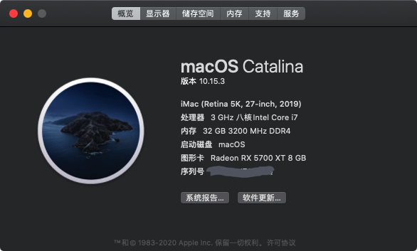
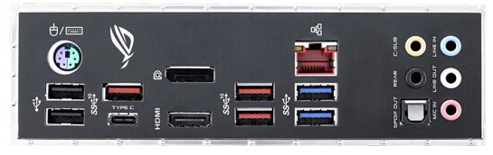

# Asus-ROG-STRIX-Z390-F-Gaming-EFI

#### 版本说明

系统版本：macOS Catalina 10.15.3

SMBIOS: iMac 19,1

OpenCore Version : 0.5.7

## Config—–PlatformInfo—–Generic 下的信息请自行补充完整
 
#### 具体配置如下：

| 硬件| 型号    |
|----|----------|
| 主板  | ASUS ROG Z390-F Gaming |
| CPU  | Intel i7-9700K   |
| 显卡  | 盈通 RX5700XT 樱瞳 |
| 内存  | 芝奇皇家戟 DDR4 3200 8G * 4   |
| 固态  | SN750 500G *2   |
| 网卡  | BCM94360CD   |

#### 完善程度：

* 蓝牙 + Wi-Fi + 接力（Hand Off）+ 随航 正常

* 所有USB接口 正常

* USB 5G 传输 正常 

* 显卡硬解  正常

* 睡眠重启 正常

